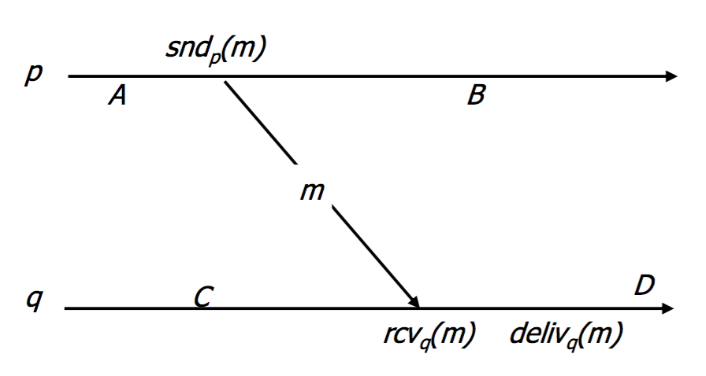
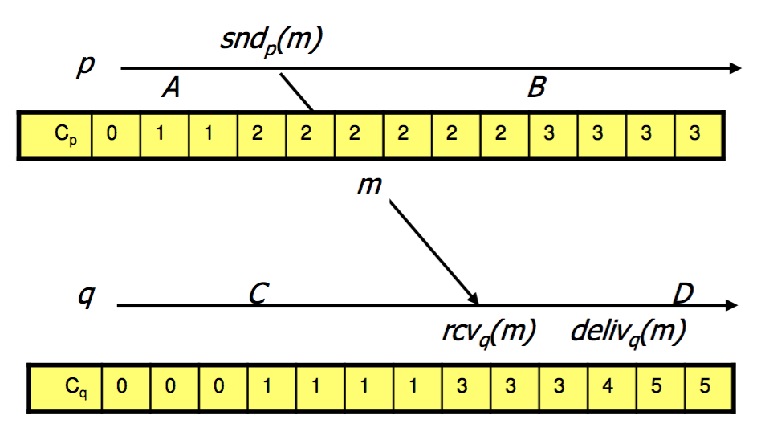
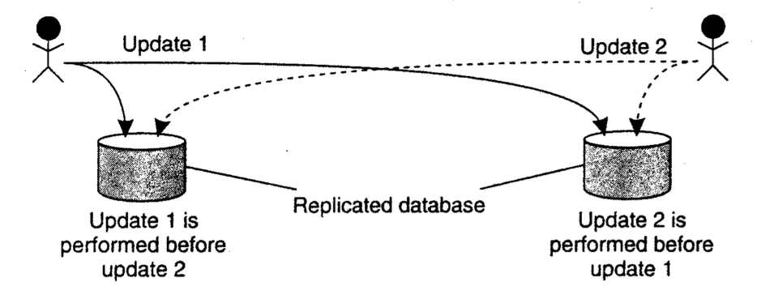
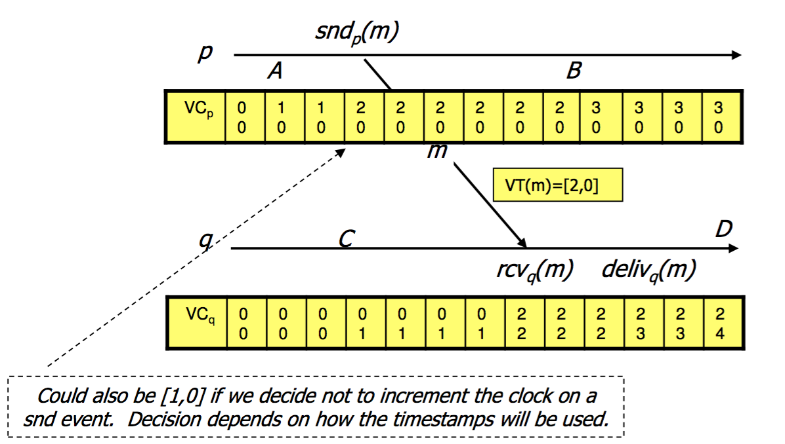

# Logical Clocks

### dDistSys  
11/05/2015  
Johan K. Jensen

------

## Happened-before relationship
## Logical clocks
## Totally-ordered multicast
## Vector clocks

------

# Happened-before relationship

--

## Happened-before relationship
- If $a$ and $b$ are two events in the same process, and $a$ comes before $b$, then $a$ → $b$.
- If $a$ is the sending of a message, and $b$ is the receipt of that message, then $a$ → $b$.
- If $a$ → $b$ and $b$ → $c$, then $a$ → $c$.

Note:
This introduces a partial ordering of events in a system with concurrently
operating processes.

--

<!-- ## Happened-before relationship -->

$$A \rightarrow^p B$$
$$C \rightarrow^q D$$
$$\text{snd}_p(m) \rightarrow^M \text{rcv}_q(m)$$
$$A \rightarrow^p \text{snd}_p(m) \rightarrow^M \text{rcv}_q(m) \rightarrow^q D$$
$$A \rightarrow D$$

------

# Lamport clocks

Note:
How do we maintain a global view on the system’s behavior that is consistent with the happened-before relation?

--

## Lamport clocks
Attach a timestamp $C(e)$ to each event $e$

- If $A$ →$^p B$ then $C(A) < C(B)$
- If $A$ corresponds to sending a message $m$, and $B$ to the receipt of that
message, then also $C(A) < C(B)$.

--

## Lamport clocks

Process $P_i$ maintains a counter $C_i$ and adjusts this counter:

- $C_i$ is incremented for any two successive events within $P_i$
- Each $snd(m)$ by process $P_i$, receives a timestamp $ts(m) = C_i$
- When $recv(m)$ in process $P_j$, then $C_j = max(C_j, ts(m))$

--

## Lamport clocks

So if $A$ → $B$ then $C(A) < C(B)$  
but **not**: if $C(A) < C(B)$ then $A$ → $B$.

------

# Totally-ordered multicast

--

## Totally-ordered multicast

A guarantee that concurrent updates on a replicated database are seen in the same order everywhere:

- $P_1$ adds $100$ to an account with $1000$
- $P_2$ increments balance with $1\%$

In absence of proper synchronization:  
replica #1 ← 1111, while replica #2 ← 1110

Note:
As an application of Lamport's logical clocks, consider the situation in which a database has been replicated across several sites.

--

## Totally-ordered multicast

- A multicast operation
- All messages are delivered in the same order to each receiver

Lamport's logical clocks can be used to implement totally-ordered multicasts in a completely distributed fashion.

--

## Totally-ordered multicast

- A message has a Lamport clock value
- When receiving a message, send an acknowledge to everybody
- Order all messages according to clock value
	- If clashes, order by e.g. process ID
- Deliver message which is acknowledged by all
- Acknowledges makes the queues become identical

------

# Vector clocks

--

## Vector clocks

Extension of Logical clocks where each process has a unique vector of times for each process:
$$VC(A) = [q, p]$$

Sending message: $VC(m) = VC_p$  
Receive message: $VC_q = max(VC_q, VC(m))$

--

## Vector clocks

--

## Comparing Vector clocks

- $VC(A) \leq VC(B)$ if
	- $\forall i, VC_A[i] \leq VC_B[i]$
- $VC(A) < VC(B)$ if
	- $VC(A) \leq VC(B)$ and $VC(A) \not= VC(B)$
	- $\exists i, VC_A[i] < VC_B[i]$

--

## Properties of Vector clocks

If $A$ → $B$, then $VC(A) < VC(B)$ (as Lamport clocks).

But also: if $VC(A) < VC(B)$ then $A$ → $B$.

This is shown by:  
If $\neg(A$ → $B)$ then $\neg (VC(A) < VC(B))$

--

## Vector clocks

If $\neg(A$ → $B)$ then $\neg (VC(A) < VC(B))$

- $A$ occurs at $p$ and $B$ at $q$
- $VC(A)[p] = k$
- There cannot be a sequence of events  
$A = E_0$ → $E_1$ → $E_2$ → $\ldots$ → $E_n = B$ (otherwise $A$ → $B$)
- Thus we must have $VC(B)[p] < k$
- Consequently $\neg(VC(A) < VC(B))$

Note:
1) We may have that p = q but not necessarily
4) B only updates VC(B)[p] to k due to an incoming VC

------

<!-- Empty last slide -->

